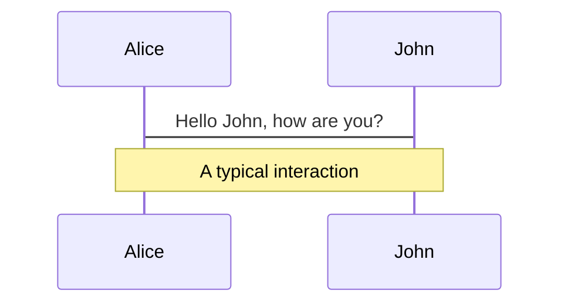

**这是我参与「第五届青训营」伴学笔记创作活动的第 14 天**

## 前言

```
欢迎使用 Slidev!
为开发者打造的演示文稿工具
```

slidev是slidevjs开发的一款开源的使用markdown来编写ppt样式的前端应用的框架

只需要在单一 Markdown 文件中编写幻灯片就可以创建一个非常漂亮的前端ppt应用

这个项目自从`0.20.0`版本我就关注来着，当时就觉得很炫很好用

昨天看到了antfu更新说在最新版本`0.39.0`里支持了简单的动画切换效果


😋感觉动画切换是ppt最重要的东西吧，很好很圆满😎

来试试


## 特性

- **支持 Markdown 语法**：Slidev 使用一种扩展的 Markdown 格式，在一个纯文本文件中存储和组织你的幻灯片。这让你专注于制作内容。而且由于内容和样式是分开的，这也使得在不同的主题之间切换变得更加容易。

- **可定制主题**：Slidev 的主题可以通过 `npm` 包的形式来分享和安装。

- **对开发者友好**：Slidev 为开发者提供了一流的代码片段支持。它同时支持 [Prism](https://prismjs.com/) 和 [Shiki](https://github.com/shikijs/shiki) 以获得像素级的完美语法高亮，并且能够随时修改代码。通过内置的 [Monaco 编辑器](https://microsoft.github.io/monaco-editor/)，它还能让你在演示文稿中进行现场编码/演示，并支持自动补全、类型悬停、甚至是 `TypeScript` 类型检查。

- **快速**：Slidev 得益于 [Vite](https://vitejs.dev/)，[Vue 3](https://v3.vuejs.org/) 和 [Windi CSS](https://windicss.org/)，为你带来了最美妙的创作体验。你所做的每一个改变都会**立即反映**到你的幻灯片上。

- **互动性 & 直观表达**：你可以编写自定义的 Vue 组件并直接在你的 MarkDown 文件中使用它们。你也可以在演示文稿中与它们互动，以更深入和直观的方式表达你的想法。

- **支持录制**：Slidev 提供了内置的录音和摄像头视图。你可以将你的演示文稿与你的相机视图一起分享，或者为你的屏幕和相机分别录制并保存。所有这些都是内置的，不需要额外的工具。

- **可移植性**：用一个命令就可以将你的幻灯片导出为 PDF 或 PNG，甚至是可托管的单页应用程序（SPA），并在任何地方分享它们。

- **可配置**：由于 Slidev 基于 Web 技术，任何可以在 Web 应用中完成的事情，Slidev 也可以做到。例如，`WebGL`、`API请求`、`iframes`，甚至是实时共享。完全取决于你的想象力!
- **演讲者模式**： 可以使用另一个窗口，甚至是你的手机来控制幻灯片。

## 安装

```
npm init slidev
```

在package.json里配置

```
{
  "scripts": {
    "dev": "slidev", //  启动 dev server
    "build": "slidev build", // 构建生产环境的单页面应用
    "export": "slidev export" // 将幻灯片导出为 pdf 格式
  }
}
```

执行 `npx slidev --help` 命令获取更多选项的详细信息。

这样就安装完成了，你只需要在`./slides.md`里编写你想要的内容就行😎

## 推荐的目录结构

```
your-slidev/
  ├── components/       # 自定义组件
  ├── layouts/          # 自定义布局
  ├── public/           # 静态资源
  ├── setup/            # 自定义 setup / hooks
  ├── styles/           # 自定义样式
  ├── index.html        # 注入的 index.html
  ├── slides.md         # 幻灯片主入口
  └── vite.config.ts    # 扩展 vite 配置
```


## Markdown 语法

#### 分隔符

使用 `---` 添加分隔符来分隔你的幻灯片。

注意 这个分隔符最好上下空两行


像这样 

你可以安装一个VSCode插件 名叫slidev 来获得更好的体验，https://marketplace.visualstudio.com/items?itemName=antfu.slidev

这个#2是插件告诉你这下面是第几张幻灯片

````
# Slidev

Hello, World!

---

# Page 2

Directly use code blocks for highlighting

```ts
console.log('Hello, World!')
```

---

# Page 3

You can directly use Windi CSS and Vue components to style and enrich your slides.

<div class="p-3">
  <Tweet id="20" />
</div>
````

像这样就创建了三张幻灯片

#### 扉页及布局

用两个分隔符来表示一个扉页块

```
---
layout: cover
---
```

两个分隔符里是`yaml`格式的对象

具体的语法如下

```
---
# 主题id 或 主题包名称
# 了解更多：https://sli.dev/themes/use.html
theme: 'default'
# 幻灯片的总标题，如果没有指定，那么将以第一张拥有标题的幻灯片的标题作为总标题
title: 'Slidev'
# titleTemplate for the webpage, `%s` will be replaced by the page's title
titleTemplate: '%s - Slidev'
# information for your slides, can be a markdown string
info: false

# 在单页（SPA）构建中启用 pdf 下载，也可以指定一个自定义 url
download: false
# 要导出文件的文件名称
exportFilename: 'slidev-exported.pdf'
# 语法高亮设置，可以使用 'prism' 或 'shiki' 方案
highlighter: 'prism'
# 在代码块中显示行号
lineNumbers: false
# 启用 monaco 编辑器，可以是 boolean，'dev' 或者 'build'
monaco: 'dev'
# 使用 vite-plugin-remote-assets 在本地下载远程资源，可以是 boolean，'dev' 或者 'build'
remoteAssets: false
# 控制幻灯片中的文本是否可以选择
selectable: true
# 启用幻灯片录制，可以是 boolean，'dev' 或者 'build'
record: 'dev'

# 幻灯片的配色方案，可以使用 'auto'，'light' 或者 'dark'
colorSchema: 'auto'
# vue-router 模式，可以使用 'history' 或 'hash' 模式
routerMode: 'history'
# 幻灯片的长宽比
aspectRatio: '16/9'
# canvas 的真实宽度，单位为 px
canvasWidth: 980
# 用于主题定制，会将属性 `x` 注入根样式 `--slidev-theme-x`
themeConfig:
  primary: '#5d8392'

# favicon 可以是本地文件路径，也可以是一个 URL
favicon: 'https://cdn.jsdelivr.net/gh/slidevjs/slidev/assets/favicon.png'
# 用于渲染图表的 PlantUML 服务器的 URL
plantUmlServer: 'https://www.plantuml.com/plantuml'
# 字体将从 Google 字体自动导入
# 了解更多：https://sli.dev/custom/fonts
fonts:
  sans: 'Roboto'
  serif: 'Roboto Slab'
  mono: 'Fira Code'

# 为所有幻灯片添加默认的 frontmatter
defaults:
  layout: 'default'
  # ...

# 绘制选项
# 了解更多：https://sli.dev/guide/drawing.html
drawings:
  enabled: true
  persist: false
  presenterOnly: false
  syncAll: true
---
```

#### 代码块

可以通过```来创建一个代码块

````
```ts
console.log('Hello, World!')
```
````

可以通过在语言名后写大括号的形式来指定特定行高亮`{}`

注意：行号从 1 开始计算。

````
```ts {2-3|5|all}
function add(
  a: Ref<number> | number,
  b: Ref<number> | number
) {
  return computed(() => unref(a) + unref(b))
}
```
````

这段代码的意思是 点进来先是2到3行高亮，再点一下2到3不亮第5行亮，再点一下整个都亮

#### Monaco 编辑器

只需在语言 id 后添加 `{monaco}` 就可以启用monaco

什么是monaco呢，可以理解为网页版的vscode那样的，可以在线编辑的

````
```ts {monaco}
console.log('HelloWorld')
```
````

#### 内联样式

你可以在 Markdown 中直接使用 `<style>` 标签来覆盖**当前幻灯片**的样式。

Slidev支持windicss的原子化写法和指令集 例如`@apply`

```
# Slidev

> Hello `world`

<style>
blockquote {
  code {
    @apply text-teal-500 dark:text-teal-400;
  }
}
</style>
```

#### 静态资源

和编写 Markdown 的方式一样，你可以使用本地或远程的 URL 的图片。

远程资源会缓存

本地资源请放到public文件夹

#### 备注

你也可以为每张幻灯片编写备注。它们将展示在 [演讲者模式](https://cn.sli.dev/guide/presenter-mode.html) 中，供你在演示时参考。

在每一页幻灯片内容最后

添加注释即可

```
---
layout: cover
---

# 第 1 页

This is the cover page.

<!-- 这是一条备注 -->

---

# 第 2 页

<!-- 这不是一条备注，因为它在幻灯片内容前 -->

The second page

<!--
这是另一条备注
-->
```

#### icon图标

很喜欢的功能

Slidev 允许你在 Markdown 中**直接**访问几乎所有的开源的图标集。

你可以通过 [Icônes](https://icones.js.org/) 来浏览访问所有可用的图标。

更详细的请看https://cn.sli.dev/guide/syntax.html#icons

#### LaTeX

这个不是很熟啊

https://demo.sli.dev/starter/8

可以看下示例 和 文档

https://katex.org/

#### 图标

这个东西也没怎么用过，只知道github什么的支持这种语法 基于https://github.com/mermaid-js/mermaid

被标记为 `mermaid` 的代码块将被转换为图形，例如：

````

````


我在typora也可以创建这个图表，感觉很好用


## 导航


导航栏默认在左下角，鼠标移动上去显示

可以用`right / space`来切换下一张幻灯片

按`g`跳出一个栏，输入页码可以跳转

更多快捷键详见https://cn.sli.dev/guide/navigation.html#navigation-bar

## 动画

重头戏

这个版本就更新了这个

#### 点击动画

`v-click` 可以用`<v-click></v-click>`标签或在标签内写`<div v-click class="text-xl p-2">`这样的指令

以下指令写法同理

`v-after` 和`v-click`绑定，这俩会一起显示

`v-click-hide`点击后不可见

`v-clicks` 只能使用标签写法 可以方便的展示一个列表

```
<v-clicks>

- Item 1
- Item 2
- Item 3
- Item 4

</v-clicks>
```

你还可以手动指定过渡动画 覆写两个类的动画

```
// the default

.slidev-vclick-target {
  transition: opacity 100ms ease;
}

.slidev-vclick-hidden {
  opacity: 0;
  pointer-events: none;
}
```

#### 运动

https://vueuse.org/functions.html#category=%40Motion

内置了vueuse的motion功能

你可以对任何元素应用 `v-motion` 指令，以对它们施加运动效果。例如：

```
<div
  v-motion
  :initial="{ x: -80 }"
  :enter="{ x: 0 }">
  Slidev
</div>
```

文本 `Slidev` 将从其初始化位置 `-80px` 移至其原始位置。

#### 页面过渡

🤩新功能！

可以在扉页中填写

```
---
transition: slide-left
---
```

这将给你一个很好的滑动效果。将其设置在首页，将适用于所有的幻灯片。您还可以为每张幻灯片设置不同的过渡。

自带的过渡效果

```
fade - Crossfade in/out
fade-out - Fade out and then fade in
slide-left - Slides to the left, slide to right when going back
slide-right - Slides to the right, slide to left when going back
slide-top - Slides to the top, slide to bottom when going back
slide-bottom - Slides to the bottom, slide to top when going back
```

还可以自定义过渡效果

```
---
transition: my-transition
---
```

```
.my-transition-enter-active,
.my-transition-leave-active {
  transition: opacity 0.5s ease;
}

.my-transition-enter-from,
.my-transition-leave-to {
  opacity: 0;
}
```

## 导出

导出为pdf 依赖于微软开源的playwright框架

[`playwright-chromium`](https://playwright.dev/docs/installation#download-single-browser-binary)

需要先安装

```
npm i -D playwright-chromium
```

使用

```
slidev export
```

可导出pdf格式

```
slidev export --format png
```

可导出png格式

## 静态部署

```
slidev build
```

编译当前幻灯片生成在`dist/`目录下，可以部署到静态托管平台

#### 提供可下载的 PDF

在扉页中设置

```
---
download: true
---
```

会在单页应用中展示下载按钮

也可以自定义url

```
---
download: 'https://myside.com/my-talk.pdf'
---
```

#### 部署到netlify

创建`netlify.toml`文件 配置

```
[build.environment]
  NODE_VERSION = "14"

[build]
  publish = "dist"
  command = "npm run build"

[[redirects]]
  from = "/*"
  to = "/index.html"
  status = 200
```

#### 部署到vercel

创建`vercel.json`文件 配置

```
{
  "rewrites": [
    { "source": "/(.*)", "destination": "/index.html" }
  ]
}
```

## 演讲录制

#### 摄像头

导航面板的小人按钮可以开启摄像头

你可以拖动它，并使用右下角的把手来调整大小。尺寸和位置将持久化存储在 `localStorage` 中，因此，可以保证多次刷新后的展示一致，无需担心位置和大小丢失的问题。

#### 录制

导航面板的摄像机按钮

可以录制麦克风和摄像头

## 演讲者模式

点击小人带麦克风的按钮

可以进入演讲者模式

需要双端在同一网络下

其他页面的实例会自动和演讲者的页面同步

## 绘图

可以在页面上画画

可以在演讲者模式中启用，会实时自动同步

支持触控笔压感

## 编辑器整合

你可以在运行中在网页上更改你的源码，他会自动同步到slide.md里

## 主题

在这里浏览主题并应用到你的实例中

https://cn.sli.dev/themes/gallery.html

## 布局

https://cn.sli.dev/builtin/layouts.html

## 总结

这篇写了不少，详细的写了我比较喜欢的ppt框架

我有一个部署的版本，地址在 https://botppt.netlify.app/

是很久之前写的辣，版本还是很老的，有时间会更新一下

😎

##  引用

https://botppt.netlify.app/1

https://cn.sli.dev/showcases.html

https://cn.sli.dev/

https://github.com/slidevjs/slidev